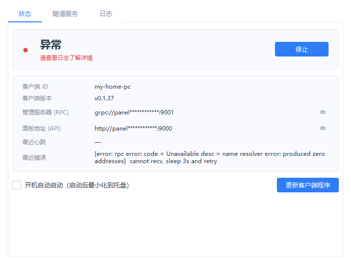
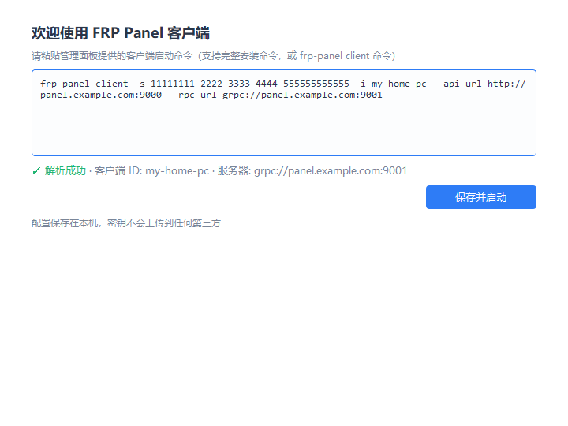

---
AIGC:
  ContentProducer: '001191110102MAD55U9H0F10002'
  ContentPropagator: '001191110102MAD55U9H0F10002'
  Label: '1'
  ProduceID: '67beba87-15c7-475e-8d79-bbc7f51185eb'
  PropagateID: '67beba87-15c7-475e-8d79-bbc7f51185eb'
  ReservedCode1: '074ce139-5902-440a-a5ae-8dd1c1cba19c'
  ReservedCode2: '074ce139-5902-440a-a5ae-8dd1c1cba19c'
---

# FRP Panel GUI

[frp-panel](https://github.com/VaalaCat/frp-panel) 客户端的 Windows 图形管理器，面向普通用户。

粘贴一条启动命令即可完成配置，无需命令行知识。程序自动下载并管理 [frp-panel](https://github.com/VaalaCat/frp-panel) 客户端，实时显示连接状态、隧道服务列表与运行日志，支持开机自启动并最小化到系统托盘。



## 功能特性

- **一键配置** — 粘贴面板提供的客户端启动命令（支持完整安装命令或 `frp-panel client ...` 命令）即可完成全部配置
- **实时状态** — 未配置 / 已停止 / 连接中 / 已连接 / 异常，一目了然；断线自动重连状态提示
- **隧道服务列表** — 自动同步面板上配置的隧道（名称 / 类型 / 本地地址 / 运行状态），无需打开浏览器
- **开机自启动** — 注册表方式（HKCU Run），无需管理员权限；自启动时自动最小化到托盘
- **系统托盘常驻** — 关闭窗口即最小化到托盘；托盘图标右下角圆点颜色实时反映连接状态；双击图标或再次运行程序可唤起主窗口
- **隐私保护** — 服务器地址默认脱敏显示（点击行尾眼睛图标可查看），客户端密钥在日志中自动脱敏
- **单实例运行** — 重复启动不会产生第二个实例，而是唤起已有窗口
- **自动管理客户端** — 首次运行自动下载 frp-panel 客户端（支持 ghfast.top 镜像加速），"更新客户端程序"按钮一键升级
- **官方服务冲突检测** — 检测到旧版官方 Windows 服务（`C:\frpp`）运行时给出提示，避免同 ID 双开冲突

## 截图预览

| 首次配置 | 隧道服务 |
|:---:|:---:|
|  |  |

## 安装与使用

### 方式一：下载打包版（推荐）

从 [Releases](../../releases) 下载 `FRPPanelGUI.exe`，双击运行。

> 首次启动会自动下载 frp-panel 客户端（约 60MB），请耐心等待。

### 方式二：源码运行

```bash
pip install PySide6
python frppanel-gui.py
```

### 首次配置

1. 在 frp-panel 管理面板上创建客户端，复制安装/启动命令
2. 程序中粘贴命令，点击 **保存并启动**
3. 完成 — 隧道在面板上配置，本程序实时显示其运行状态

勾选 **开机自动启动** 后，每次开机程序会静默启动、自动连接并最小化到托盘。

## 数据存储位置

所有数据保存在本机 `%LOCALAPPDATA%\FRPPanelGUI\`：

| 文件 | 说明 |
|---|---|
| `config.json` | 客户端配置（含密钥，仅保存在本机） |
| `frp-panel-client.exe` | frp-panel 客户端程序 |
| `client.log` | 客户端运行日志（已脱敏，超过 1MB 自动轮转） |

## 从官方安装方式迁移

如果之前用官方 `install.ps1` 安装过（`C:\frpp\frpp.exe` 的 Windows 服务方式），请先停止并卸载旧服务，再用本程序：

```
C:\frpp\frpp.exe stop
C:\frpp\frpp.exe uninstall
```

同一客户端 ID 双开会互相冲突，本程序启动时也会自动检测并提示。

## 构建

推送到 `v*` 标签时 GitHub Actions 自动打包并发布 Release：

```bash
git tag v1.0.0
git push origin v1.0.0
```

本地打包：

```bash
pip install pyinstaller PySide6 pillow
python -c "from PIL import Image; Image.open('docs/icons/frp.png').save('frp.ico', sizes=[(16,16),(32,32),(48,48),(64,64),(128,128),(256,256)])"
pyinstaller --noconfirm --onefile --windowed --name FRPPanelGUI --icon frp.ico --add-data "docs/icons/frp.png;frp.png" frppanel-gui.py
```

## 致谢

- [frp-panel](https://github.com/VaalaCat/frp-panel) — 由 VaalaCat 开发的 frp 可视化面板
- [homarr dashboard-icons](https://github.com/homarr-labs/dashboard-icons) — 应用图标

> AI生成